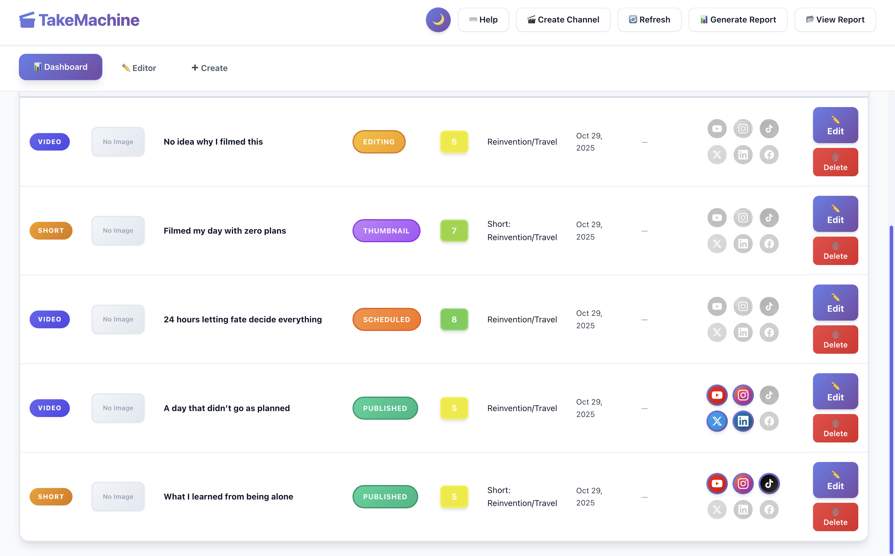
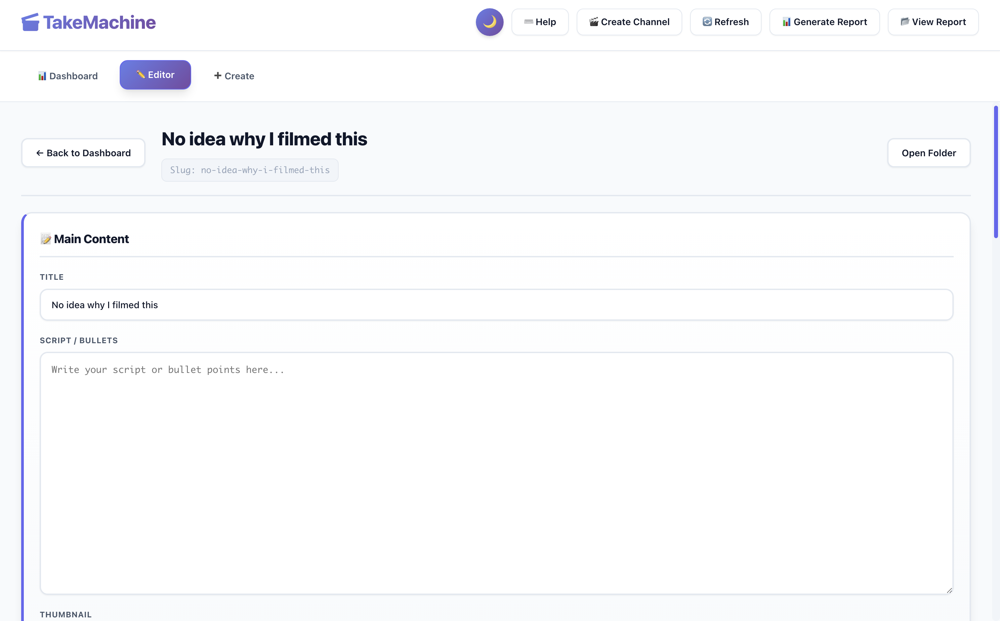

#  TakeMachine

**Professional content management for Videos and Shorts**

Manage your video content across YouTube, Instagram, TikTok, Twitter, LinkedIn, and Facebook.

[](https://opensource.org/licenses/MIT)
[](https://www.electronjs.org/)
[](https://nodejs.org/)

---

## 📸 Screenshots

### Main Dashboard


### Content List View


### Video Editor



---

##  Features

-  Videos & Shorts management
-  Dark/Light themes (Ctrl+T)
-  Table and grid views
-  Smart search and filters
-  Status tracking workflow
-  Multi-platform support
-  Drag & drop manual ordering
-  Multi-platform social media tracking

📖 **See [FEATURES.md](FEATURES.md) for complete feature list**

---

##  Quick Start

**Windows:** Double-click `TakeMachine.bat`

**macOS:** Double-click `TakeMachine.command`

**Linux:** Run `./TakeMachine.sh`

> Scripts auto-install dependencies on first run

### Manual

```bash
git clone https://github.com/elliotcohle/TakeMachine.git
cd TakeMachine
npm install
npm start
```

---

##  Usage

### Creating Content

**Create:** Click `+ New Video` or `+ New Short` button

### Managing Content

**Search:** Type in the search bar to filter by title, topic, or status

**Filter:** 
- Use the Type dropdown to show Videos, Shorts, or All
- Use the Status dropdown to filter by workflow stage
- Use the Sort dropdown to organize your content

**Manual Ordering:** 
- Select "Manual" from the Sort dropdown
- Drag and drop items to reorder them
- Your custom order is automatically saved

### Editing

**Quick Edit:** Click on any status pill to cycle through workflow stages

**Full Edit:** Click the ✏️ Edit button to open the complete editor with:
- Title, description, tags
- Thumbnail management
- Dates and scheduling
- Platform-specific content
- Score rating (1-10)

### Views

**Theme:** Press `Ctrl+T` to toggle Dark/Light mode

**Layout:** Switch between Table and Grid views with the view buttons

**Social Platforms:** Click platform icons to track where content is published

---

##  Tech Stack

- **Electron 35.7** - Cross-platform desktop application framework
- **Node.js 14+** - JavaScript runtime
- **Vanilla JavaScript** - No frameworks, pure performance
- **HTML5 Drag & Drop API** - Native drag and drop support
- **CSS Grid & Flexbox** - Modern responsive layouts

---

##  Workflow Stages

TakeMachine tracks your content through 6 production stages:

1. **Draft** - Initial idea and planning
2. **Filmed** - Content recorded
3. **Editing** - Post-production in progress
4. **Thumbnail** - Creating thumbnail and final touches
5. **Scheduled** - Ready and scheduled for publishing
6. **Published** - Live on platforms

---

##  Development

### Setup

```bash
git clone https://github.com/elliotcohle/TakeMachine.git
cd TakeMachine
npm install
npm start
```

### Build

```bash
cd automation/desktop

# macOS
npm run build-dmg

# Windows
npm run build-win
```

### Project Structure

```
TakeMachine/
├── automation/desktop/     # Electron app
│   ├── main.js            # Main process
│   ├── preload.js         # IPC bridge
│   └── renderer/          # UI
│       ├── index.html
│       ├── renderer.js
│       └── style.css
├── content/               # User content storage
│   ├── videos/
│   └── shorts/
└── screenshots/           # Documentation images
```

---

##  Contributing

Contributions are welcome! Please see [CONTRIBUTING.md](CONTRIBUTING.md) for guidelines.

---

##  License

MIT License

---

**TakeMachine v1.0.0**